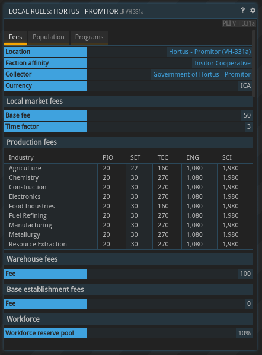

## General Information

The local rules are a set of rules, fees and taxes that are employed for a given location. The local government can
change the local rules via motions. All revenues from fees and taxes are transferred to the government. Local rules can
be viewed with the `LR` command. Here is an example:

## Fees

### Local Market Fees

The local market fee is due when posting an ad. It consists of two parts: The base fee and a time component. The time
component increases linearly with the ad duration, e.g. how long the ad will be visible on the local market.

Depending on the location of the local market the two components have the following limits:

| Type               | Base Part | Time Part |
|--------------------|-----------|-----------|
| Starting planet    | 50 - 150  | 3 - 8     |
| Faction planet     | 25 - 200  | 2 - 10    |
| Non-Faction planet | 0 - 9_999 | 0 - 9_999 |

### Production Fees

Production fees have to be paid once a production order starts. The actual height of the production fee for any given
order is determined once the order is added to the queue.

Production fees can be defined for each expertise category / workforce type pair. The production fee can be calculated
by building the weighted sum of all workforces that are required by the given building.

Depending on the location the production fees have the following limits:

| Type               | Production Fee |
|--------------------|----------------|
| Starting planet    | 10 - 90        |
| Faction planet     | 5 - 120        |
| Non-Faction planet | 0 - 9_999      |

#### Example

The production of Polymer Granulate requires a Polymer Plant that employs 10 pioneers and 25 settlers when fully staffed.
Let's assume the production fees for pioneers are 15 and the ones for settlers 12. In sum the production fee will be 

(10 * 15 + 25 * 12) / (10 + 25) = 12.9

Since the Polymer Granulate only takes 8h24m to make, the final production fee is

12.9 * (8.5 / 24) = 4.56

### Warehouse Fees

Warehouse fees are due each week for each rented unit. If the warehouse fee cannot be paid due to a lack of funds, the
warehouse inventory is locked and unavailable to the user. Once funds become available the warehouse fees are
automatically paid and unlock the inventory.

Depending on the location the warehouse fees have the following limits:

| Type               | Production Fee |
|--------------------|----------------|
| Starting planet    | 100 - 2_500    |
| Faction planet     | 75 - 5_000     |
| Non-Faction planet | 0 - 10_000     |

### Base Establishment Fees

The base establishment fees are an optional, additional cost when building a base. Its purpose is to help the local government to adapt to the increase in population infrastructure upkeep materials and workforce demand due to new bases.

The first base is always exempt from the base establishment fee.

Depending on the location the fees have the following limits:

| Type               | Base Establishment Fee |
|--------------------|------------------------|
| Starting planet    | 0 - 10_000             |
| Faction planet     | 0 - 20_000             |
| Non-Faction planet | 0 - 10_000_000         |
